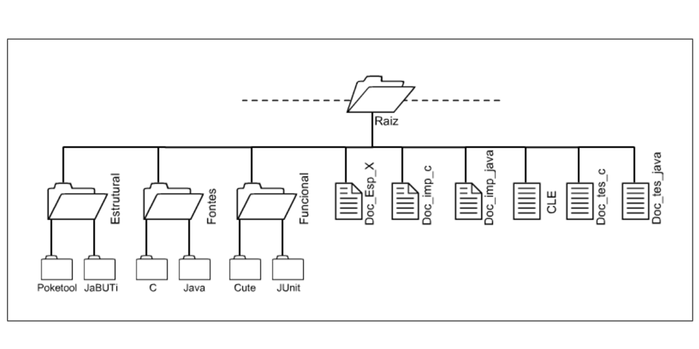

# MasterDegree_Artifacts 🐤🐤🐤
Artifacts generated during my Master degree at the University of São Paulo - Brazil (USP).

<body>
<section>

In this project, I planned, designed, and conducted an experimental study to characterize and evaluate the cost and strength of structural (<em> Data Flow and Control Flow criteria </em>) and functional testing criteria (<em>Equivalence Partition and Boundary Value Analysis</em>), comparing object-oriented and procedural programs. The contributions of this quantitative research were:
<ul>
  <li>
    Obtaining initial results about the investigated research questions;
  </li>
  <li>
    Artifacts generation for the definition and conduction of further experimental studies;
  </li>
  <li>
    Supporting the training and teaching of software testing activity.
  </li>
  
  
  
</section>  
  
<h2> Artifacts Directory </h2>  
<section>
The artifacts generated in the experiment are listed in the <a href="https://github.com/pradoprojects/MasterDegree_Artifacts/tree/main/Publica" target="_blank"> Publica</a> directory. Each ".rar" file represents the set of code/test cases/documentation for a particular program specification. The directory structure is organized as shown in the diagram below:

                                                               
  

   
  
 <ul>
  <li>
   <strong> Poketool: </strong> C/C++ test cases adequated to the structural criteria. 
  </li>
   
  <li>
   <strong> JaBUTi: </strong> JUnit test cases adequated to the structural criteria. 
  </li>
   
  <li>
   <strong> C: </strong> C/C++ programs source code. 
  </li>
   
  <li>
   <strong> Java: </strong> Java programs source code. 
  </li>
   
  <li>
   <strong> Cute: </strong> C/C++ test cases adequated to the functional criteria. 
  </li>
   
  <li>
   <strong> JaBUTi: </strong> JUnit test cases adequated to the functional criteria. 
  </li>
   
  <li>
   <strong> Doc_Esp_X: </strong> Program especification. 
  </li>
   
  <li>
   <strong> Doc_imp_c: </strong> C/C++ program documentation (list of function headers for the functional testing). 
  </li>
   
  <li>
   <strong> Doc_imp_java: </strong> Java program documentation (list of methods headers for the functional testing). 
  </li>
   
  <li>
   <strong> CLE: </strong> Form filled out with the Equivalence Classes for the program.
  </li>
   
  <li>
   <strong> Doc_tes_c: </strong> C/C++ test documentation. 
  </li>
   
  <li>
   <strong> Doc_tes_java: </strong> JUnit test documentation. 
  </li>
   
 </ul>
<section>

<a href="https://github.com/pradoprojects/MasterDegree_Artifacts/blob/main/CLEI_Publication.pdf" target="_blank">Main Publication</a>
                                                                                                                  
                                                                                                                  
</body>
